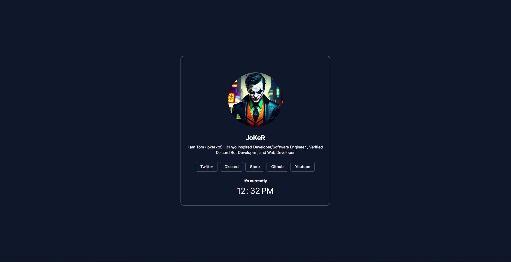

## JoKeR Linktree v1.0.0

This is a my version of a Linktree to help users spread there social links and other links in a more organized way and with a better design.

## preview



## Installing

Download our latest release [here](https://github.com/JoKeRxTD/joker_linktree.git) or clone our repository with the following command:

```bash
cd your/directory
git clone
```

After cloning the repository, you need to install the dependencies, to do that, run the following command:

```bash
npm install
```

After installing the dependencies, you can run the project with the following command:

```bash
npm run dev
```

## Usage

You can use this project to create your own Linktree, just follow the steps below:

1. Create a new repository on your GitHub account.
2. Clone the repository to your local machine.
3. Edit the `src/app/page.tsx` file with your links, This is the main homepage.

## Using

This project is using the following technologies:
- [Shadcn/UI](https://ui.shadcn.com)
- [Tailwindcss](https://tailwindcss.com)
- [NextJS](https://nextjs.org)
- [Typescript](https://www.typescriptlang.org)

## Todo

- [ ] Add a theme mode toggles
- [ ] Add a backend dashboard to edit the links
- [ ] Add Discord OAuth2 to get the user avatar and username for dashboard login

## Notes

- Clock gets your system local time, there is no need to edit this.

## Contributing

If you want to contribute to this project, you can fork this repository, make your changes and create a pull request.